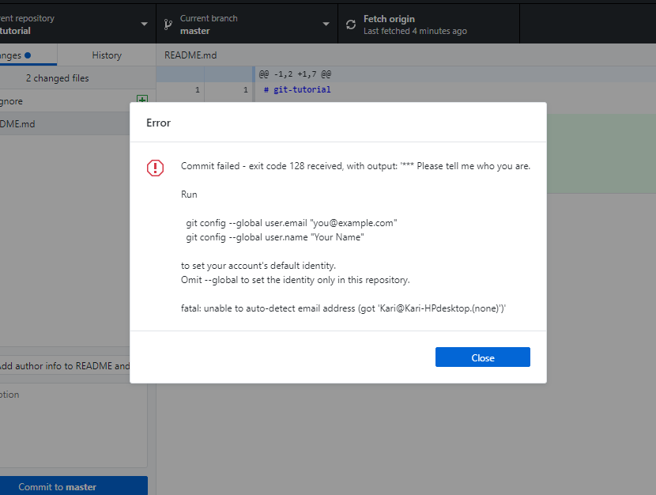

# Getting setup tutorial

<iframe width="560" height="315" src="https://www.youtube.com/embed/rfK1kauUNBA" frameborder="0" allow="accelerometer; autoplay; encrypted-media; gyroscope; picture-in-picture" allowfullscreen></iframe>

Before you get started with this course, you need to install a few tools and create a few accounts. All of these things are free and available on all major platforms (Windows, OS X, and Linux).

Most screenshots and examples will be on a Mac OS machine.

## Sign up

- [GitHub](https://github.com) - We will store all code in GitHub. There is also a Student Developer Pack which gives you unlimited private repositories and other useful resources.

## Desktop tools

- [GitHub Desktop](https://desktop.github.com/) - This tool makes working with GIT visual.
- [Visual Studio Code](https://code.visualstudio.com/) - Code editor we will be using throughout the course.
- [Google Chrome](https://www.google.com/chrome/) - Web browser with developer tools that will allow us to inspect Web pages and javascript.

## Command line tools

- [Node JS and NPM](https://nodejs.org/en/download/) - These tools will help us build modern Web pages.
These tools can be downloaded from the website.

### Homebrew

If you are comfortable using [Homebrew](https://brew.sh/) (MacOS only) to manage applications on your computer, these tools are available by using the following commands:

```
# Install Homebrew
/usr/bin/ruby -e "$(curl -fsSL https://raw.githubusercontent.com/Homebrew/install/master/install)"

# Install the desktop applications
brew cask install google-chrome
brew cask install visual-studio-code
brew cask install github

# Install Node and NPM
brew install node
```

## Troubleshooting

GIT username or email address error

If you get this error when pushing to GitHub Desktop



[Open a Terminal](https://www.wikihow.com/Open-a-Terminal-Window-in-Mac) or [Command Prompt](https://www.digitalcitizen.life/7-ways-launch-command-prompt-windows-7-windows-8) and type the following commands. Replace `{Firstname}`, `{Lastname}`, `{Email}` with your name and email address you use to sign up for GitHub.com.

```
git config --global user.email "{Email}"
git config --global user.name "{Firstname} {Lastname}"
```

## Customizing VS Code

These extensions will help you as a developer get the most out of Visual Studio Code.

- [StyleLint](https://marketplace.visualstudio.com/items?itemName=shinnn.stylelint)
- [Prettier](https://marketplace.visualstudio.com/items?itemName=esbenp.prettier-vscode)
- [Path Intellisense](https://marketplace.visualstudio.com/items?itemName=christian-kohler.path-intellisense)
- [IntelliSense for CSS class names](https://marketplace.visualstudio.com/items?itemName=Zignd.html-css-class-completion)
- [CSS Peek](https://marketplace.visualstudio.com/items?itemName=pranaygp.vscode-css-peek)
- [Auto close tag](https://marketplace.visualstudio.com/items?itemName=formulahendry.auto-close-tag)
- [Auto rename tag](https://marketplace.visualstudio.com/items?itemName=formulahendry.auto-rename-tag)
- [Bracket Pair Colorizer](https://marketplace.visualstudio.com/items?itemName=CoenraadS.bracket-pair-colorizer)
- [Spelling Checker](https://marketplace.visualstudio.com/items?itemName=streetsidesoftware.code-spell-checker)
- [Indenticator](https://marketplace.visualstudio.com/items?itemName=SirTori.indenticator)

## Chrome extensions

- [Web Developer Toolbar](https://chrispederick.com/work/web-developer/)
- [aXe Accessibility Tester](https://chrome.google.com/webstore/detail/axe/lhdoppojpmngadmnindnejefpokejbdd?hl=en-US)